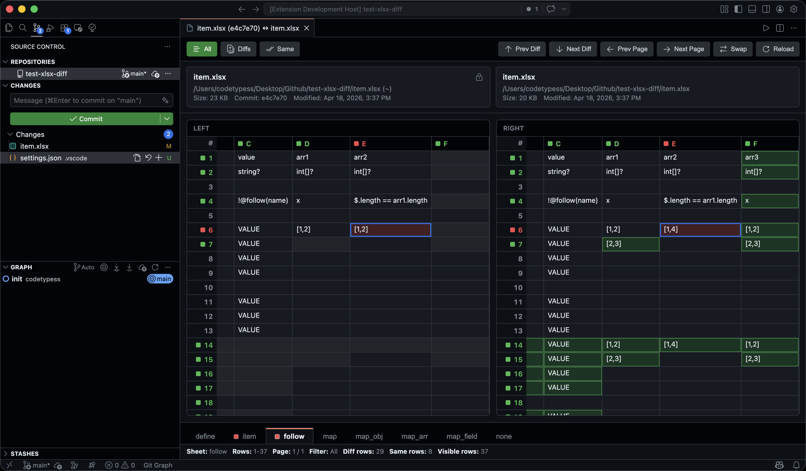

# XLSX Diff

A VS Code extension for visually comparing and editing `.xlsx` workbooks — directly inside the editor, with first-class Git / SCM integration.



---

## Features

- **Side-by-side spreadsheet diff** — view left and right workbooks in a clean table layout with colour-coded differences (modified / added / removed).
- **Git & SCM integration** — click any `.xlsx` file in the Source Control panel to open the diff view automatically.
- **Sheet tabs** — navigate between multiple worksheets; tabs show diff markers when a sheet contains changes.
- **Row filters** — toggle between *All rows*, *Diff rows only*, or *Same rows only*.
- **Diff navigation** — jump to the previous / next changed cell with a single click or keyboard shortcut.
- **Pagination** — large workbooks are split into pages for performance.
- **Row height sync** — left and right rows are height-matched so multi-line cells align correctly.
- **Formula display** — cells containing formulas show an `fx` badge.
- **Cell editing** — double-click any cell in a local (non-read-only) workbook to edit it inline. Press **Enter** or **Tab** to save; press **Escape** to cancel.
- **Swap** — swap left and right sides with one click.
- **Auto-reload** — the diff view refreshes automatically when a watched file changes on disk.
- **Bilingual UI** — Chinese (Simplified) and English, following the VS Code display language setting.

---

## Usage

### Compare two files

1. Right-click an `.xlsx` file in the **Explorer** and choose **XLSX Diff: Compare Active XLSX With…** — then pick the second file.
2. Or open the Command Palette (`⌘⇧P` / `Ctrl+Shift+P`) and run **XLSX Diff: Compare Two XLSX Files**.

### Compare from Source Control

Open the **Source Control** panel, then click any `.xlsx` file listed under *Changes*. The XLSX diff view opens automatically instead of VS Code's built-in binary diff.

### Keyboard shortcuts in the diff view

| Action | Key |
|---|---|
| Next diff | Click **↓ Next Diff** button |
| Prev diff | Click **↑ Prev Diff** button |
| Next page | Click **→ Next Page** button |
| Prev page | Click **← Prev Page** button |

### Editing a cell

1. Make sure the target file is a local `.xlsx` file (not a Git history version or read-only file).
2. **Double-click** the cell you want to edit.
3. Type the new value.
4. Press **Enter** or **Tab** to save — the file is written immediately and the diff view reloads.
5. Press **Escape** to cancel without saving.

> Ghost cells (e.g. the placeholder on the left side of a row that only exists on the right) are not editable.

---

## Settings

| Setting | Values | Default | Description |
|---|---|---|---|
| `xlsx-diff.displayLanguage` | `auto`, `en`, `zh-cn` | `auto` | Controls the language used in diff panel prompts and UI labels. `auto` follows the active VS Code display language. |

---

## Git difftool integration

You can configure Git to use this extension as your difftool for `.xlsx` files.

**`~/.gitconfig`:**

```ini
[diff]
    tool = xlsx-vscode
[difftool "xlsx-vscode"]
    cmd = "node /absolute/path/to/vscode-xlsx-diff/scripts/xlsx-difftool.mjs" "$LOCAL" "$REMOTE" "$MERGED"
    prompt = false
```

**`.gitattributes`** in your repository:

```gitattributes
*.xlsx diff=xlsx
```

Running `git difftool` on an `.xlsx` file will then open the XLSX Diff panel in VS Code.

If you are using a different publisher ID, set the environment variable before running the script:

```bash
export VSCODE_XLSX_DIFF_EXTENSION_ID=your-publisher.xlsx-diff
```

---

## Local development

```bash
# Install dependencies
npm install

# Start watch build (extension + webview)
npm run watch

# Press F5 in VS Code to launch the Extension Development Host
# Then right-click an .xlsx file in Explorer or SCM view

# Type-check all targets
npm run check-types

# Run tests
npm test
```

---

## License

MIT. See [LICENSE](./LICENSE).

## Current behavior notes

- Comparison is value/formula oriented
- renamed sheets are matched by content signature
- merged range changes are surfaced as sheet-level warnings
- row pagination defaults to `200` rows per page
- the current loader scans each sheet's used range eagerly

## Known gaps

- no style-level diff visualization yet
- no chart / pivot / macro diff yet
- no merge tool flow yet
- large sheets are paginated in the UI, but workbook parsing is still eager
